<picture>
  <source media="(prefers-color-scheme: dark)" srcset="assets/hero-dark.svg">
  <source media="(prefers-color-scheme: light)" srcset="assets/hero-light.svg">
  
</picture>

<picture>
  <source media="(prefers-color-scheme: dark)" srcset="assets/statement-dark.svg">
  <source media="(prefers-color-scheme: light)" srcset="assets/statement-light.svg">
  
</picture>

<picture>
  <source media="(prefers-color-scheme: dark)" srcset="assets/specimen-dark.svg">
  <source media="(prefers-color-scheme: light)" srcset="assets/specimen-light.svg">
  
</picture>

<picture>
  <source media="(prefers-color-scheme: dark)" srcset="assets/colophon-dark.svg">
  <source media="(prefers-color-scheme: light)" srcset="assets/colophon-light.svg">
  
</picture>

  <a href="https://artechio.com/">artechio.com</a>
  &nbsp;·&nbsp;
  <a href="https://linkedin.com/in/lunaticbrain">LinkedIn</a>
  &nbsp;·&nbsp;
  <a href="https://stackoverflow.com/users/2911422">Stack Overflow</a>

